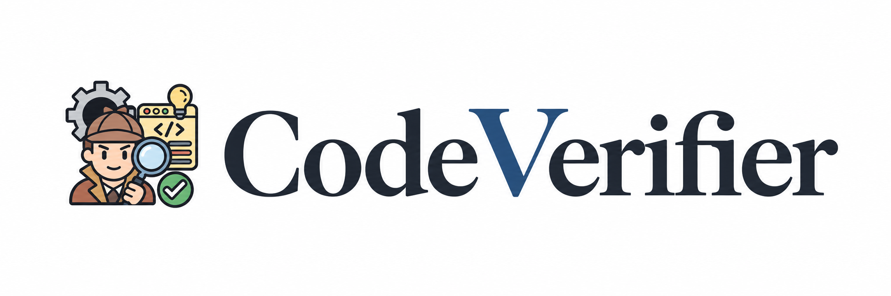

<p align="center">
  
</p>

<p align="center">
  <strong>Learning to verify code from execution and repair evidence</strong>
</p>

<p align="center">
  From evidence-projected supervision to region-aware online optimization.
</p>

<p align="center">
  <a href="#-quick-start">Quick Start</a> ·
  <a href="#-training">Training</a> ·
  <a href="#-model-weights">Model Weights</a>
</p>

<p align="center">
  
  
  
  
</p>

> [!NOTE]
> This anonymous repository contains the CodeVerifier training code. Model checkpoints are released separately through an anonymous Hugging Face repository.

## 🌐 Why CodeVerifier?

Execution provides reliable feedback, but it often arrives too late for large candidate pools, online policy updates, and repository workflows. CodeVerifier supplies timely reward signals for reinforcement learning with verifiable rewards (RLVR) and candidate search, as well as rapid quality feedback for filtering generated training data before a full test run.

Rather than returning only a scalar score, CodeVerifier produces a verdict, a brief explanation, and supporting code regions for complete programs, intermediate edits, and repository code states. It learns these judgments from historical execution outcomes and successful repairs through evidence projection and RVPG.

## ✨ Highlights

| | |
|---|---|
| **Evidence-projected supervision** | Execution verdicts determine the judgment target, while repair intervals retain teacher regions supported by observed fixes. |
| **Structured verification** | Each prediction contains a verdict, a concise reason, and localized evidence rather than a scalar score alone. |
| **Competition and repository code** | The same training stack covers online-judge programs and project-level code states with their native verdict spaces. |
| **Region-aware optimization** | RVPG routes global verdict utility and local region utility through separate token masks before applying the clipped objective. |
| **Two-stage training** | The online stage starts from the matching evidence-projected SFT checkpoint, keeping the handoff explicit. |
| **Built on ms-swift** | The release keeps CodeVerifier-specific data and optimization code separate from the bundled upstream framework. |

## 🧭 How it works

1. **Collect execution evidence.** Each training item pairs a rendered code state with an execution verdict and repair-associated line intervals.
2. **Project supervised targets.** Teacher candidates supply candidate rationales and regions; evidence projection retains the regions supported by repair evidence.
3. **Run SFT.** Swift trains the structured output contract and produces the checkpoint used to initialize online optimization.
4. **Run RVPG.** The online trainer samples response groups, computes verdict and region advantages, routes them to their fields, and updates the verifier.

## 🚀 Quick start

Create an environment and install the bundled Swift framework together with the CodeVerifier package:

```bash
python -m venv .venv
source .venv/bin/activate
python -m pip install -e ./third_party/ms-swift
python -m pip install -e ".[dev]"
```

Fill a configuration under `configs/sft` or `configs/online`. You can inspect either launch command without starting training:

```bash
python scripts/launch_sft.py \
  --config configs/sft/9b.yaml \
  --model "<base-model-path>" \
  --output "<sft-output-directory>" \
  --dry-run

python scripts/launch_online.py \
  --config configs/online/9b.yaml \
  --model "<sft-checkpoint>" \
  --dataset "<online-training-jsonl>" \
  --adapter "<rvpg-swift-adapter>" \
  --output "<online-output-directory>" \
  --dry-run
```

Remove `--dry-run` after checking the generated command.

## 🧪 Training

### Stage I: evidence-projected SFT

Evidence projection combines the execution verdict, repair intervals, and teacher candidates. The execution result supplies the verdict label; interval overlap selects repair-supported regions; the projected record becomes the assistant target used by Swift SFT.

Start SFT with:

```bash
python scripts/launch_sft.py \
  --config configs/sft/9b.yaml \
  --model "<base-model-path>" \
  --output "<sft-output-directory>"
```

### Stage II: online RVPG

RVPG begins from the corresponding SFT checkpoint. For every prompt, the trainer samples a response group, evaluates verdict and region quality, normalizes the advantages within the group, routes them through field masks, and applies asymmetric clipping with KL regularization.

Start the online stage with:

```bash
python scripts/launch_online.py \
  --config configs/online/9b.yaml \
  --model "<sft-checkpoint>" \
  --dataset "<online-training-jsonl>" \
  --adapter "<rvpg-swift-adapter>" \
  --output "<online-output-directory>"
```

The Swift adapter connects rollout outputs to the CodeVerifier scorer and constructs the verdict and region masks. The framework-independent objective is implemented in [`src/codeverifier/training/rvpg.py`](src/codeverifier/training/rvpg.py). See [the training guide](docs/TRAINING.md) for data preparation, stage handoff, resume behavior, and the full launch contract.

## 📦 Model weights

The review checkpoint is available through the anonymous Hugging Face mirror:

https://anonymous-hf.com/a/9lomute2oezs/

The checkpoint follows the Hugging Face Transformers layout. Local training accepts either a hub identifier or a downloaded model directory through `--model`.

## 🏗️ Repository map

```text
src/codeverifier/
├── schema.py                     structured predictions and line regions
└── training/
    ├── evidence_projection.py    execution- and repair-grounded targets
    └── rvpg.py                   field-wise advantages and clipped objective
configs/
├── sft/                          Stage I templates for 2B, 4B, and 9B
└── online/                       Stage II templates for 2B, 4B, and 9B
examples/training/                training prompts and supervision fields
scripts/                          SFT/RL launchers and release validation
tests/                            projection and policy-loss checks
third_party/ms-swift/             bundled upstream framework
```

Validate the release package without starting a training run:

```bash
python scripts/validate_release.py
python -m compileall -q src scripts tests
```

## 🙏 Acknowledgments

CodeVerifier is based on and modified from [ms-swift](https://github.com/modelscope/ms-swift). The upstream source and Apache-2.0 attribution are retained in [`third_party/ms-swift`](third_party/ms-swift) and [`THIRD_PARTY_NOTICES.md`](THIRD_PARTY_NOTICES.md).

## 🖊️ Citation

Citation metadata will be added with the paper release.
